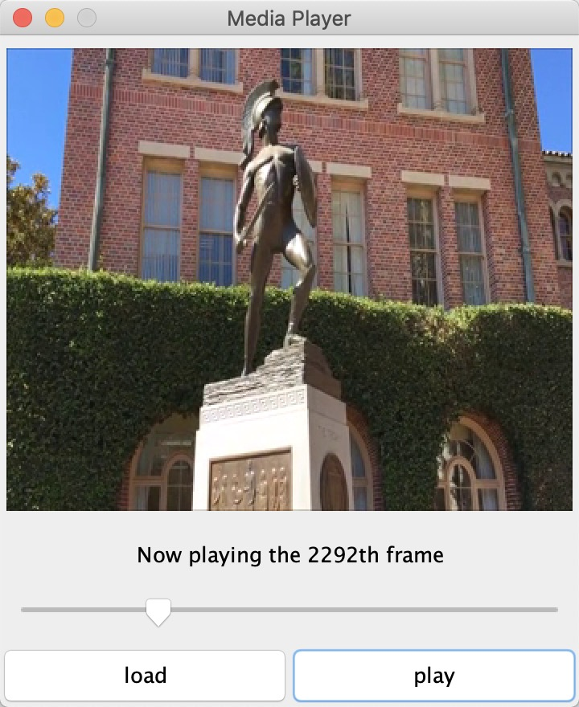

# USC CSCI-576 2021 FALL Final Project
A simple media player powered by Java Swing with the ability to sync audio and video stream  
You are welcome to modify or extend it with additional features!  

  

##### Synchronization
The synchronization consists of 2 parts: calibration and compensation. Calibration is used to  
measure the actual waiting time by comparing it with target frame rate. Compensation is used  
to adjust the frame rate for the next frame according to the actual duration time for current  
frame. If video is slower, the waiting time for the next frame will be reduced; If video is faster,  
we do the opposite.  

##### Performance
The playback thread gives up CPU and wait in the background before rendering the next frame  
Normally it takes up to 80% reduced CPU resources comparing to busy-waiting solutions  

##### Dataset Links
* [AlFilm](https://drive.google.com/file/d/1X7xJV0em3uiRn05Y-B5pRDPVkAx1BsgN/view?usp=sharing)
* [London](https://drive.google.com/file/d/1asHib_JR-xik9FylzS-uzvGARFbTJl7c/view?usp=sharing)
* [NewYorkCity](https://drive.google.com/file/d/1B8WbMcsKiyJFV5erhpVQDUVuAIRqp1Uk/view?usp=sharing)
* [USC](https://drive.google.com/file/d/1XjmxxeHgBIZb_uMnKP2U9k_E8ejTk9Do/view?usp=sharing)
